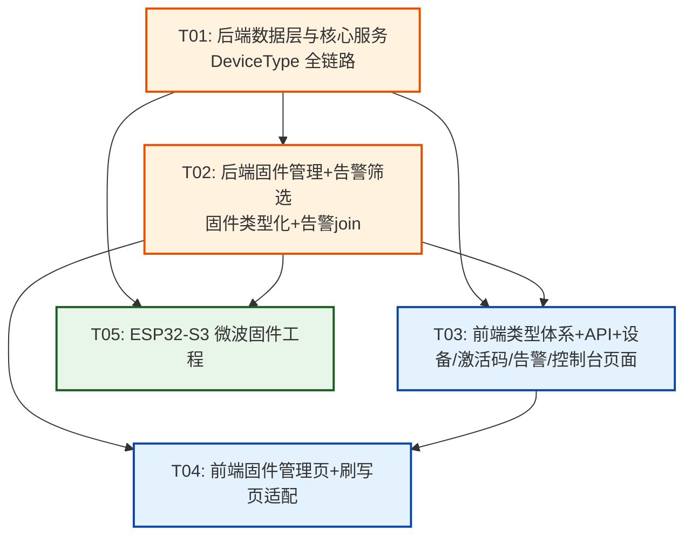

# 系统架构设计 — pir-cloud 微波人体检测分支

> 架构师：高见远 | 版本：1.0 | 日期：2025-07
> 基于 PRD `docs/PRD-microwave.md` 与代码探索结果编写

---

## 目录

- [Part A: 系统设计](#part-a-系统设计)
  - [1. 实现方案](#1-实现方案)
  - [2. 文件列表](#2-文件列表)
  - [3. 数据结构与接口](#3-数据结构与接口)
  - [4. 程序调用流程](#4-程序调用流程)
  - [5. 待明确事项](#5-待明确事项)
- [Part B: 任务分解](#part-b-任务分解)
  - [6. 依赖包列表](#6-依赖包列表)
  - [7. 任务列表](#7-任务列表)
  - [8. 共享知识](#8-共享知识)
  - [9. 任务依赖图](#9-任务依赖图)

---

# Part A: 系统设计

## 1. 实现方案

### 1.1 核心技术挑战

| 挑战 | 说明 | 应对策略 |
|------|------|----------|
| **DeviceType 全链路引入** | 数据库→后端 API→前端→固件，四个层面都要支持设备类型区分，且对存量红外数据零破坏 | 枚举字段 `@default(infrared)` + 存量回填 + API 向后兼容（不传 deviceType 默认 infrared） |
| **FirmwareVersion 唯一约束变更** | `version` 从全局唯一改为 `(version, device_type)` 联合唯一，允许红外与微波各有相同版本号 | Prisma `@@unique([version, device_type])` 替换 `@unique`，所有依赖 `findUnique({where:{version}})` 的代码改用联合查询 |
| **is_latest 从全局唯一改为每类型唯一** | 红外和微波各自有独立的"最新固件"，`setLatest` 清除范围从全局改为同 `device_type` | `updateMany({ where: { is_latest: true, device_type } })` |
| **通知文案按设备类型差异化** | 告警 message、邮件 alarmType、QQ tag 均硬编码"人体检测告警"/"有人"，需改为按 device_type 动态 | `validateDevice` 一并查出 `device_type` → 贯穿 `dispatch` → `sendEmailNotification`/`sendQQNotification` |
| **ESP32-S3 固件移植** | ESP8266→ESP32-S3 平台迁移：WiFi/WebServer/HTTPClient 库替换、EEPROM→NVS(Preferences)、引脚重分配、RCWL-0515 驱动适配 | 新建 `firmware-microwave/` 独立工程，参照旧固件架构逐模块移植 |
| **设备内 OTA** | 旧红外固件无 OTA，微波固件需补齐 | ESP32 `Update` 库 + `HTTPClient` 下载 + 版本比对 + 写 flash 重启 |
| **刷写页 ESP32-S3 参数适配** | esptool-js 的 flashSize/flashFreq/flashMode/芯片识别正则均硬编码 ESP8266 | `EsptoolFlasher` 接收 `deviceType` prop，按类型切换参数映射表 |

### 1.2 后端改造方案

**框架沿用**：Fastify 4 + Prisma + MySQL 8，无需更换框架。

**改造要点**：

1. **Prisma Schema** — 新增 `DeviceType` 枚举，三表加字段：
   ```prisma
   enum DeviceType {
     infrared
     microwave
   }
   ```
   - `Device.device_type DeviceType @default(infrared)`
   - `ActivationCode.device_type DeviceType @default(infrared)`
   - `FirmwareVersion.device_type DeviceType @default(infrared)`
   - `FirmwareVersion`：`version @unique` → 移除，改为 `@@unique([version, device_type])`
   - 各表新增 `@@index([device_type])`
   - 迁移策略：`prisma db push`（开发）或 `ALTER TABLE ... ADD COLUMN ... DEFAULT 'infrared'`（生产），存量数据自动回填为 `infrared`

2. **设备服务 (`device.service.ts`)**：
   - `bindDevice`：创建 Device 时 `device_type` 从 `activationCode.device_type` 继承
   - `listDevices`：返回字段新增 `deviceType`；支持 `deviceType` query 过滤
   - `getDevice`：返回字段新增 `deviceType`
   - `activateDevice`：返回字段新增 `deviceType`（供固件端确认）

3. **激活码服务 (`activation.service.ts`)**：
   - `generateCodes`：新增 `deviceType` 参数，`createMany` 写入 `device_type`
   - `listCodes`：返回 `deviceType`；支持 `deviceType` query 过滤
   - `exportCodes`：CSV 新增 `deviceType` 列；支持 `deviceType` 过滤

4. **上报服务 (`report.service.ts`)**：
   - `validateDevice`：`select` 新增 `device_type`，返回类型新增 `device_type`
   - `handleReport`：创建 alarm 事件时 `detail.message` 改为按 `device.device_type` 动态：
     - `infrared` → `'红外人体检测告警'`
     - `microwave` → `'微波人体检测告警'`
   - `handleReport` 调用 `NotificationService.dispatch` 时传入 `device_type`
   - `handleHeartbeat`：直接查询处 `select` 新增 `device_type`，传给 `dispatch`

5. **通知服务 (`notification.service.ts`)**：
   - `DeviceInfo` 接口新增 `device_type: DeviceType`
   - `dispatch`：接收 `device_type`，传给 `sendEmailNotification`/`sendQQNotification`
   - `sendEmailNotification`：`alarmType` 由硬编码改为按 `device_type` 动态
   - `sendQQNotification`：tag 改为带类型前缀 `[红外·有人]`/`[微波·有人]`，上线/下线同理

6. **公开固件服务 (`firmware.service.ts`)**：
   - `getLatest(deviceType?)`：按 `device_type` 过滤，不传时默认 `infrared`；返回 `downloadUrl` 带 `?deviceType=` 参数
   - `getLatestRecord(deviceType?)`：同理
   - `getByVersion(version, deviceType?)`：改用 `findUnique({ where: { version_device_type: { version, device_type } } })`

7. **管理员固件服务 (`admin/firmware.service.ts`)**：
   - `uploadFirmware`：新增 `deviceType` 参数，写入 `device_type`；唯一性校验改为联合查询；`isLatest=true` 时清除范围限定同 `device_type`
   - `setLatest`：清除范围限定同 `device_type`（先查出目标固件的 `device_type`，再 `updateMany({ where: { is_latest: true, device_type } })`）
   - `listFirmwares`：支持 `deviceType` query 过滤；返回 `deviceType`

8. **告警服务 (`alarm.service.ts`)**：
   - `listAlarms`：新增 `deviceType` 过滤，通过 `device: { device_type }` join 实现
   - 返回列表可选附带 `deviceType`（从 join 的 device 表取）

### 1.3 前端改造方案

**框架沿用**：React 18 + Vite + MUI 5 + Tailwind + Zustand + React Query + react-router-dom 6。

**改造要点**：

1. **类型定义 (`types/index.ts`)**：
   - 新增 `export type DeviceType = 'infrared' | 'microwave'`
   - `DeviceInfo` 新增 `deviceType: DeviceType`
   - `FirmwareVersionInfo` 新增 `deviceType: DeviceType`
   - `ActivationCodeInfo` 新增 `deviceType: DeviceType`
   - `LatestFirmwareInfo` 新增 `deviceType: DeviceType`
   - `AlarmLog` 新增可选 `deviceType?: DeviceType`

2. **常量 (`utils/constants.ts`)**：
   - 新增 `DEVICE_TYPE_MAP`：
     ```typescript
     export const DEVICE_TYPE_MAP: Record<DeviceType, {
       label: string; color: 'primary' | 'secondary'; icon: 'sensors' | 'radar';
     }> = {
       infrared:  { label: '红外', color: 'primary',   icon: 'sensors' },
       microwave: { label: '微波', color: 'secondary', icon: 'radar' },
     };
     ```

3. **API 层**：
   - `device.api.ts`：`listDevices` 新增可选 `deviceType` 参数
   - `firmware.api.ts`：`getLatestFirmware` 新增可选 `deviceType` 参数；`listFirmwares`/`uploadFirmware` 新增 `deviceType`
   - `admin.api.ts`：`generateActivationCodes`/`listActivationCodes`/`exportActivationCodesUrl` 新增 `deviceType`

4. **页面改造**（详见文件列表）：
   - DevicesPage：类型列 + 筛选
   - DeviceDetailPage：类型行
   - BindDeviceDialog：绑定成功展示类型
   - DashboardPage：空状态文案改通用
   - FirmwarePage：类型列 + 筛选 + 上传选类型
   - FlashPage + EsptoolFlasher：类型选择器 + 参数适配
   - ActivationCodesPage：类型列 + 筛选 + 生成选类型
   - AlarmsPage：类型筛选（P1）

### 1.4 固件方案

**新建独立工程** `firmware-microwave/`（与旧 `firmware/` 并列），不修改旧红外固件。

**平台**：PlatformIO + Arduino，`esp32-s3-devkitc-1` board。

**移植策略**：逐模块参照旧固件架构，替换 ESP8266 专属 API：

| 旧固件（ESP8266） | 新固件（ESP32-S3） | 说明 |
|---|---|---|
| `ESP8266WiFi.h` | `WiFi.h` | WiFi 核心 |
| `ESP8266WebServer.h` | `WebServer.h` | AP Captive Portal |
| `ESP8266HTTPClient.h` | `HTTPClient.h` | HTTP 上报 |
| `EEPROM.h` (RAM 镜像) | `Preferences.h` (NVS) | 持久化：token/WiFi/激活码 |
| `LittleFS.h` | `LittleFS.h` | 离线缓存（ESP32 也支持） |
| `ESP.wdtFeed()` | `feedLoopWDT()` 或 `yield()` | 看门狗 |
| `ESP.getFlashChipRealSize()` | `ESP.getFlashChipSize()` | Flash 信息 |
| `digitalPinToInterrupt()` | `digitalPinToInterrupt()` | 中断（ESP32 全 GPIO 支持中断） |

**引脚分配**（Q5 已决策）：

| 功能 | GPIO | 说明 |
|------|------|------|
| RCWL-0515 OUT 信号 | GPIO4 | 输入，支持中断，启动无脉冲 |
| 板载 RGB LED | GPIO48 | DevKitC-1 自带 WS2812，用 NeoPixel 驱动 |
| 配网按钮 | GPIO0 | BOOT 键，长按 5s 进 AP 模式 |

**RCWL-0515 驱动适配**：
- RCWL-0515 OUT 引脚高电平=有人，与 PIR 传感器行为一致
- 驱动逻辑可基本复用旧 `pir_sensor.cpp` 的中断+状态机+防抖方案
- 命名改为 `microwave_sensor.{h,cpp}`，类名 `MicrowaveSensor`
- RCWL-0515 无需预热等待（与 HC-SR501 不同），`PIR_STARTUP_SUPPRESS_MS` 可缩短或保留保守值

**OTA 方案**：
- 新增 `ota_manager.{h,cpp}` 模块
- 周期性（默认 1 小时）调 `GET /api/firmware/latest?deviceType=microwave` 获取最新版本元数据
- 比对版本号（语义化版本比较），有新版则从 `downloadUrl` 下载
- 使用 ESP32 `Update` 库写入 flash，完成后 `ESP.restart()`
- OTA 过程中 LED 指示升级状态，失败回滚（ESP32 OTA 有双分区，天然支持回滚）

**AP 热点命名**：`PirCloud-MW-Setup-<chipId后4位>`（区别于红外的 `PirCloud-Setup-XXXX`）

### 1.5 框架选型确认

| 层 | 框架/技术 | 版本 | 说明 |
|----|----------|------|------|
| 后端 | Fastify | 4.x | 沿用现有 |
| 后端 ORM | Prisma | 现有版本 | 沿用，schema 变更用 `db push` |
| 后端 DB | MySQL | 8.x | 沿用 |
| 前端 | React + Vite | 18 + 5.x | 沿用现有 |
| 前端 UI | MUI + Tailwind | 5.x | 沿用现有 |
| 前端状态 | Zustand + React Query | 现有版本 | 沿用 |
| 固件 | PlatformIO + Arduino | espressif32@6.x+ | **新增** esp32-s3 平台 |
| 固件 OTA | ESP32 Update 库 | 内置 | **新增** |
| 固件 LED | Adafruit_NeoPixel | ^1.12 | **新增**（驱动 GPIO48 RGB LED） |

---

## 2. 文件列表

### 2.1 后端（相对 `server/`）

#### 修改文件

| # | 文件路径 | 改动概述 |
|---|---------|---------|
| B01 | `prisma/schema.prisma` | 新增 `DeviceType` 枚举；Device/ActivationCode/FirmwareVersion 三表加 `device_type` 字段+索引；FirmwareVersion 唯一约束改联合 |
| B02 | `src/types/index.ts` | 新增 `DeviceType` 类型导出 |
| B03 | `src/modules/device/device.service.ts` | `bindDevice` 继承类型；`listDevices`/`getDevice`/`activateDevice` 返回 `deviceType`；`listDevices` 支持 `deviceType` 过滤 |
| B04 | `src/modules/device/device.schema.ts` | `listDevicesSchema` querystring 新增 `deviceType` 枚举 |
| B05 | `src/modules/device/device.controller.ts` | `listDevicesHandler` 解析 `deviceType` query 传给 service |
| B06 | `src/modules/admin/activation/activation.service.ts` | `generateCodes` 新增 `deviceType` 参数；`listCodes`/`exportCodes` 返回+过滤 `deviceType` |
| B07 | `src/modules/admin/activation/activation.schema.ts` | `generateCodesSchema` body 新增 `deviceType`；`listCodesSchema`/`exportCodesSchema` query 新增 `deviceType` |
| B08 | `src/modules/admin/activation/activation.controller.ts` | 解析 `deviceType` 传给 service |
| B09 | `src/modules/report/report.service.ts` | `validateDevice` select 新增 `device_type`；`handleReport` 按类型生成 alarm message；`dispatch` 传 `device_type`；`handleHeartbeat` 同理 |
| B10 | `src/modules/notification/notification.service.ts` | `DeviceInfo` 加 `device_type`；`sendEmailNotification` alarmType 按类型；`sendQQNotification` tag 加类型前缀 |
| B11 | `src/modules/firmware/firmware.service.ts` | `getLatest`/`getLatestRecord`/`getByVersion` 接受 `deviceType` 参数，默认 `infrared` |
| B12 | `src/modules/firmware/firmware.controller.ts` | `getLatestHandler`/`downloadLatestHandler`/`downloadByVersionHandler` 解析 `deviceType` query |
| B13 | `src/modules/firmware/firmware.routes.ts` | 路由 query schema 新增 `deviceType`（可选） |
| B14 | `src/modules/admin/firmware/firmware.service.ts` | `uploadFirmware` 新增 `deviceType`；唯一性校验改联合；`setLatest` 按类型清除；`listFirmwares` 支持过滤 |
| B15 | `src/modules/admin/firmware/firmware.controller.ts` | `uploadFirmwareHandler` 解析 multipart `deviceType` 字段；`listFirmwaresHandler` 解析 query |
| B16 | `src/modules/admin/firmware/firmware.schema.ts` | `listFirmwaresSchema` query 新增 `deviceType` |
| B17 | `src/modules/alarm/alarm.service.ts` | `listAlarms` 支持 `deviceType` 过滤（join device 表）；返回附带 `deviceType` |
| B18 | `src/modules/alarm/alarm.schema.ts` | `listAlarmsSchema` query 新增 `deviceType` |
| B19 | `src/modules/alarm/alarm.controller.ts` | 解析 `deviceType` query 传给 service |

#### 新增文件

无。后端全部为现有文件修改。

### 2.2 前端（相对 `web/`）

#### 修改文件

| # | 文件路径 | 改动概述 |
|---|---------|---------|
| F01 | `src/types/index.ts` | 新增 `DeviceType` 类型；`DeviceInfo`/`FirmwareVersionInfo`/`ActivationCodeInfo`/`LatestFirmwareInfo`/`AlarmLog` 加 `deviceType` |
| F02 | `src/utils/constants.ts` | 新增 `DEVICE_TYPE_MAP`（label/color/icon） |
| F03 | `src/api/device.api.ts` | `listDevices` 新增可选 `deviceType` 参数 |
| F04 | `src/api/firmware.api.ts` | `getLatestFirmware`/`listFirmwares`/`uploadFirmware` 新增 `deviceType` |
| F05 | `src/api/admin.api.ts` | `generateActivationCodes`/`listActivationCodes`/`exportActivationCodesUrl` 新增 `deviceType` |
| F06 | `src/api/alarm.api.ts` | `listAlarms` 新增可选 `deviceType` 参数 |
| F07 | `src/pages/devices/DevicesPage.tsx` | 表头新增"设备类型"列（Chip+图标）；筛选区新增类型下拉 |
| F08 | `src/pages/devices/DeviceDetailPage.tsx` | 设备信息卡片新增"设备类型"行（Chip） |
| F09 | `src/components/device/BindDeviceDialog.tsx` | 绑定成功结果新增"设备类型"行；helperText 补充提示 |
| F10 | `src/pages/dashboard/DashboardPage.tsx` | 空状态文案"红外感应设备"→"人体检测设备" |
| F11 | `src/pages/admin/FirmwarePage.tsx` | 表头新增"设备类型"列+筛选；上传对话框新增类型选择 |
| F12 | `src/pages/flash/FlashPage.tsx` | 顶部新增类型选择器；说明文案/配网指引按类型动态 |
| F13 | `src/components/flash/EsptoolFlasher.tsx` | 接收 `deviceType` prop；按类型切换 flashSize/freq/mode/芯片正则/日志文案/配网热点名 |
| F14 | `src/pages/admin/ActivationCodesPage.tsx` | 表头新增"设备类型"列+筛选；生成对话框新增类型选择 |
| F15 | `src/pages/alarms/AlarmsPage.tsx` | 筛选区新增"设备类型"下拉（P1） |
| F16 | `src/hooks/useDevices.ts` | `useDevices` 支持传入 `deviceType` 参数（如需后端过滤） |

#### 新增文件

无。前端全部为现有文件修改。

### 2.3 固件（新建 `firmware-microwave/`，与旧 `firmware/` 并列）

#### 新建文件

| # | 文件路径 | 说明 |
|---|---------|------|
| W01 | `firmware-microwave/platformio.ini` | ESP32-S3 工程配置（board/分区/PSRAM/lib_deps） |
| W02 | `firmware-microwave/src/main.cpp` | 入口：setup/loop 协作式调度（移植自旧 main.cpp） |
| W03 | `firmware-microwave/src/config.h` | 编译期配置：服务器地址/路径/超时/防抖/AP前缀/OTA间隔/版本号 |
| W04 | `firmware-microwave/src/pins.h` | 引脚定义：GPIO4(sensor)/GPIO48(LED)/GPIO0(button) |
| W05 | `firmware-microwave/src/wifi_manager.h` | WiFi 管理接口（移植） |
| W06 | `firmware-microwave/src/wifi_manager.cpp` | WiFi 连接+AP Captive Portal（WebServer.h 替换） |
| W07 | `firmware-microwave/src/microwave_sensor.h` | 微波传感器驱动接口（移植自 pir_sensor.h） |
| W08 | `firmware-microwave/src/microwave_sensor.cpp` | 中断+状态机+防抖（适配 RCWL-0515） |
| W09 | `firmware-microwave/src/reporter.h` | HTTP 上报接口（移植） |
| W10 | `firmware-microwave/src/reporter.cpp` | 上报/心跳/激活（HTTPClient.h 替换） |
| W11 | `firmware-microwave/src/storage.h` | 持久化接口（Preferences NVS + LittleFS 离线缓存） |
| W12 | `firmware-microwave/src/storage.cpp` | NVS key-value 存储 + LittleFS 离线缓存（移植离线缓存逻辑） |
| W13 | `firmware-microwave/src/ota_manager.h` | OTA 自升级接口（**新增**） |
| W14 | `firmware-microwave/src/ota_manager.cpp` | 版本比对+下载+Update库刷写+重启 |
| W15 | `firmware-microwave/src/heartbeat.h` | 心跳定时器接口（移植） |
| W16 | `firmware-microwave/src/heartbeat.cpp` | 心跳定时器实现 |
| W17 | `firmware-microwave/src/led_indicator.h` | LED 状态指示接口（移植，适配 RGB LED） |
| W18 | `firmware-microwave/src/led_indicator.cpp` | NeoPixel 驱动状态指示 |
| W19 | `firmware-microwave/src/serial_cmd.h` | 串口命令接口（移植） |
| W20 | `firmware-microwave/src/serial_cmd.cpp` | AT 命令处理 |
| W21 | `firmware-microwave/src/diagnostics.h` | 诊断统计接口（移植） |
| W22 | `firmware-microwave/src/diagnostics.cpp` | 统计计数器 |
| W23 | `firmware-microwave/data/` | LittleFS 数据目录（空，用于文件系统镜像） |

---

## 3. 数据结构与接口

> 完整 Mermaid 类图见 `docs/class-diagram.mermaid`

### 3.1 Prisma Schema 改动

```prisma
// ==================== 新增枚举 ====================

enum DeviceType {
  infrared
  microwave
}

// ==================== 模型改动 ====================

model ActivationCode {
  // ... 现有字段 ...
  device_type  DeviceType  @default(infrared)  // 新增

  // ... 现有索引 ...
  @@index([device_type])  // 新增
}

model Device {
  // ... 现有字段 ...
  device_type  DeviceType  @default(infrared)  // 新增

  // ... 现有索引 ...
  @@index([device_type])  // 新增
}

model FirmwareVersion {
  // ... 现有字段 ...
  device_type  DeviceType  @default(infrared)  // 新增
  version      String   @db.VarChar(50)        // 移除 @unique，改为联合唯一

  // ... 现有索引 ...
  @@unique([version, device_type])  // 新增：联合唯一
  @@index([device_type])            // 新增
  @@index([is_latest, device_type]) // 新增：加速"每类型最新"查询
}
```

### 3.2 后端 DTO / 接口签名变化

#### DeviceService

```typescript
// bindDevice — Device 创建时继承 ActivationCode 的 device_type
async bindDevice(userId: number, activationCodeStr: string): Promise<{
  id: number; name: string; deviceToken: string;
  status: DeviceStatus; deviceType: DeviceType;  // 新增
  createdAt: string;
}>

// listDevices — 支持按类型过滤
async listDevices(
  userId: number, page: number, pageSize: number,
  deviceType?: DeviceType,  // 新增
): Promise<{ list: DeviceListItem[]; total: number; page: number; pageSize: number }>
// DeviceListItem 新增 deviceType: DeviceType

// getDevice — 返回 deviceType
async getDevice(userId: number, deviceId: number): Promise<{
  device: { /* ...现有字段... */ deviceType: DeviceType };  // 新增
  config: DeviceConfigInfo | null;
}>

// activateDevice — 返回 deviceType（固件端可确认）
async activateDevice(activationCodeStr: string): Promise<{
  deviceToken: string; deviceId: number; deviceName: string;
  deviceType: DeviceType;  // 新增
}>
```

#### AdminActivationService

```typescript
// generateCodes — 新增 deviceType 参数
async generateCodes(
  count: number, prefix: string, adminId: number,
  deviceType: DeviceType = 'infrared',  // 新增
): Promise<string[]>

// listCodes — 支持按类型过滤，返回 deviceType
async listCodes(
  filters: { status?: ActivationCodeStatus; deviceType?: DeviceType },  // 新增 deviceType
  page: number, pageSize: number,
): Promise<{ list: ActivationCodeListItem[]; total: number; page: number; pageSize: number }>
// ActivationCodeListItem 新增 deviceType: DeviceType

// exportCodes — 支持按类型过滤，CSV 含 deviceType 列
async exportCodes(
  filters: { status?: ActivationCodeStatus; deviceType?: DeviceType },  // 新增 deviceType
): Promise<string>
```

#### ReportService

```typescript
// validateDevice — 返回类型新增 device_type
private async validateDevice(
  deviceToken: string | undefined,
  activationCode: string | undefined,
): Promise<{
  id: number; user_id: number; name: string;
  device_type: DeviceType;  // 新增
} | null>

// handleReport — alarm message 按类型动态
// 第 93 行 '人体检测告警' 改为:
const alarmMessage = device.device_type === 'microwave'
  ? '微波人体检测告警'
  : '红外人体检测告警';

// dispatch 调用传入 device_type
NotificationService.dispatch(
  { id: device.id, name: device.name, user_id: device.user_id,
    device_type: device.device_type },  // 新增
  { id: event.id, type: event.type, detail: event.detail, created_at: event.created_at },
);
```

#### NotificationService

```typescript
// DeviceInfo 接口新增 device_type
interface DeviceInfo {
  id: number;
  name: string;
  user_id: number;
  device_type: DeviceType;  // 新增
}

// sendEmailNotification — alarmType 按类型动态
const alarmType = device.device_type === 'microwave'
  ? '微波人体检测告警'
  : '红外人体检测告警';

// sendQQNotification — tag 加类型前缀
const typePrefix = device.device_type === 'microwave' ? '微波' : '红外';
const tag =
  event.type === 'alarm'   ? `${typePrefix}·有人` :
  event.type === 'online'  ? `${typePrefix}·上线` :
  event.type === 'offline' ? `${typePrefix}·下线` : '通知';
```

#### FirmwareService（公开）

```typescript
// getLatest — 接受 deviceType，默认 infrared
async getLatest(deviceType: DeviceType = 'infrared'): Promise<LatestFirmwareDto | null>
// 返回的 downloadUrl 带 ?deviceType= 参数

// getLatestRecord — 接受 deviceType
async getLatestRecord(deviceType: DeviceType = 'infrared'): Promise<FirmwareVersion | null>

// getByVersion — 改用联合唯一查询
async getByVersion(version: string, deviceType: DeviceType = 'infrared'): Promise<FirmwareVersion | null>
```

#### AdminFirmwareService

```typescript
// uploadFirmware — 新增 deviceType 参数
async uploadFirmware(
  fileBuffer: Buffer, filename: string, version: string,
  changelog: string | undefined, isLatest: boolean, adminId: number,
  deviceType: DeviceType = 'infrared',  // 新增
): Promise<{ /* ... */ deviceType: DeviceType }>

// setLatest — 按类型清除其它最新
async setLatest(firmwareId: number): Promise<void>
// 内部：先查出 fw.device_type，再 updateMany({ where: { is_latest: true, device_type: fw.device_type } })

// listFirmwares — 支持按类型过滤
async listFirmwares(
  page: number, pageSize: number,
  deviceType?: DeviceType,  // 新增
): Promise<{ list: FirmwareListItem[]; total: number; page: number; pageSize: number }>
// FirmwareListItem 新增 deviceType: DeviceType
```

#### AlarmService

```typescript
// listAlarms — 支持 deviceType 过滤（join device 表）
async listAlarms(
  userId: number,
  filters: {
    deviceId?: number;
    type?: EventType;
    startDate?: Date;
    endDate?: Date;
    deviceType?: DeviceType;  // 新增
  },
  page: number, pageSize: number,
): Promise<{ list: AlarmListItem[]; total: number; page: number; pageSize: number }>
// where 条件新增: device: { device_type: filters.deviceType }
// AlarmListItem 新增 deviceType?: DeviceType（从 device join 取）
```

### 3.3 固件 DeviceConfig（NVS）

旧固件使用 EEPROM + 结构体 + CRC8。新固件改用 ESP32 `Preferences` (NVS) key-value 存储：

```cpp
// Preferences 命名空间
#define NVS_NAMESPACE "pir_mw"

// NVS 键名
#define KEY_DEVICE_TOKEN   "token"       // String (64 chars hex)
#define KEY_ACTIVATION_CODE "act_code"   // String (17 chars, WB-XXXX-XXXX-XXXX)
#define KEY_WIFI_SSID      "ssid"        // String (max 63)
#define KEY_WIFI_PASS      "pass"        // String (max 63)
#define KEY_FW_VERSION    "fw_ver"       // String (当前固件版本号)
#define KEY_OTA_CHECK_AT  "ota_ts"       // uint32_t (上次 OTA 检查时间戳)
#define KEY_CONFIGURED    "configured"   // bool (是否已配网)

// Storage 类接口（与旧固件保持一致的方法签名）
class Storage {
public:
  static void begin();
  static bool hasValidConfig();
  static bool saveDeviceToken(const char* token);
  static bool updateWifi(const char* ssid, const char* pass);
  static bool updateActivationCode(const char* code);
  static String getDeviceToken();
  static String getWifiSsid();
  static String getWifiPass();
  static String getActivationCode();
  static String getFwVersion();
  static bool setFwVersion(const char* ver);
  static void reset();

  // LittleFS 离线缓存（接口不变）
  static bool cacheOfflineEvent(const char* status, uint32_t ts);
  static bool peekOfflineEvent(String& outStatus, uint32_t& outTs);
  static void dropOfflineEvent();
  static size_t offlineEventCount();
  static constexpr size_t OFFLINE_CACHE_MAX = 50;
};
```

### 3.4 类图（Mermaid）

详见 `docs/class-diagram.mermaid`，此处给出文字概要：

- **Prisma 模型层**：`DeviceType` 枚举关联到 `Device`、`ActivationCode`、`FirmwareVersion` 三个模型
- **后端服务层**：`DeviceService`、`AdminActivationService`、`ReportService`、`NotificationService`、`FirmwareService`、`AdminFirmwareService`、`AlarmService` 均新增 `deviceType` 参数/返回
- **前端类型层**：`DeviceType` 类型贯穿 `DeviceInfo`、`FirmwareVersionInfo`、`ActivationCodeInfo`、`LatestFirmwareInfo`
- **固件层**：`Storage`(NVS)、`MicrowaveSensor`、`Reporter`、`OtaManager`、`WifiManager`、`LedIndicator`、`Heartbeat`

---

## 4. 程序调用流程

> 完整 Mermaid 时序图见 `docs/sequence-diagram.mermaid`

### 4.1 设备配网激活流程（微波设备）

```
设备上电 → Storage.begin()(NVS) → 无 WiFi 凭据 → WifiManager.enterApConfig()
→ AP 热点 PirCloud-MW-Setup-XXXX → 用户连接 → 访问 192.168.4.1
→ 填写 WiFi + 激活码 → POST /set → Storage 保存 → 重启
→ WiFi 连接 → 无 device_token → POST /api/device/activate (X-Activation-Code)
→ 后端查 ActivationCode(status=bound, device_type) → 返回 {deviceToken, deviceType}
→ Storage.saveDeviceToken(NVS) → 激活完成 → 进入正常上报循环
```

### 4.2 上报告警流程（按类型差异化文案）

```
MicrowaveSensor.tick() 检测 presence 边沿 → Reporter.reportStatus("presence")
→ POST /api/report (X-Device-Token, {status, timestamp, rssi})
→ ReportService.handleReport → validateDevice (查出 device_type)
→ 防抖通过 → 创建 alarm 事件 detail.message = "微波人体检测告警"
→ NotificationService.dispatch(device含device_type)
→ sendEmailNotification: alarmType = "微波人体检测告警"
→ sendQQNotification: tag = "[微波·有人]"
```

### 4.3 固件 OTA 流程

```
OtaManager.tick() (每小时) → GET /api/firmware/latest?deviceType=microwave
→ 返回 {version, downloadUrl, checksum}
→ 比对 Storage.getFwVersion() vs latest.version → 有新版
→ HTTPClient 下载 downloadUrl (302 → Alist)
→ Update.begin() → Update.write() → Update.end()
→ Storage.setFwVersion(newVersion) → ESP.restart()
```

### 4.4 面板绑定设备流程（带类型）

```
用户输入激活码 → POST /api/devices/bind {activationCode}
→ DeviceService.bindDevice → 查 ActivationCode (含 device_type)
→ 创建 Device (device_type 继承自 ActivationCode)
→ 返回 {device, deviceType}
→ 前端 BindDeviceDialog 显示 "设备类型: 微波" Chip
```

### 4.5 刷写页按类型刷写流程

```
用户选择"微波" → FlashPage 调 getLatestFirmware({deviceType:'microwave'})
→ 显示最新微波固件卡片 → EsptoolFlasher(deviceType="microwave")
→ 连接串口 → 识别芯片(校验 /S3/i) → 下载固件
→ writeFlash({flashSize:'8MB', flashMode:'dio', flashFreq:'80m'})
→ 成功提示 "连接 PirCloud-MW-Setup-XXXX 热点配网"
```

---

## 5. 待明确事项

| # | 事项 | 当前假设 | 影响 |
|---|------|---------|------|
| 1 | ESP32-S3 变体确定 N8R2 还是 N15R8 | 两者都支持，刷写页默认 8MB 可切换；固件 `platformio.ini` 用 `board_build.partitions` 统一配置 | 若只选一种可简化，但当前设计已兼容两者 |
| 2 | RCWL-0515 启动抑制时间 | 沿用旧固件 `PIR_STARTUP_SUPPRESS_MS=60000`（保守值），RCWL-0515 实际无需长预热 | 可后续实测缩短 |
| 3 | OTA 检查间隔 | 默认 1 小时（`OTA_CHECK_INTERVAL_MS=3600000`） | 可配置，需实测功耗/流量影响 |
| 4 | GPIO48 RGB LED 驱动方式 | 使用 `Adafruit_NeoPixel` 单像素控制 | 若板子无 RGB LED 需改用普通 GPIO + 外接 LED |
| 5 | `getByVersion` 下载路由 deviceType 参数 | `GET /api/firmware/download/:version?deviceType=infrared` 默认 infrared | 向后兼容，存量调用无感 |
| 6 | 告警历史页 deviceType 过滤为 P1 | 当前设计已包含后端支持（join device 表），前端筛选下拉为 P1 优先级 | 后端先行，前端可后补 |
| 7 | 激活码类型预览接口 (BIND-P1-1) | P1 优先级，暂不在 P0 任务中 | 需新增 `GET /api/activation/check?code=xxx` 接口 |
| 8 | 旧红外固件是否也加 deviceType 支持 | 不改旧固件，红外设备继续用 `/api/firmware/latest`（不传 deviceType 默认 infrared） | 零影响 |

---

# Part B: 任务分解

## 6. 依赖包列表

### 6.1 后端新增 npm 包

无新增。所有改造基于现有 Fastify 4 + Prisma + MySQL 依赖。

### 6.2 前端新增 npm 包

无新增。`Sensors` 和 `Radar` 图标已在 `@mui/icons-material` 中内置。

### 6.3 固件新增库（`firmware-microwave/platformio.ini` lib_deps）

```ini
lib_deps =
    bblanchon/ArduinoJson@^6.21.5     ; JSON 解析（OTA 版本比对、激活响应解析）
    adafruit/Adafruit NeoPixel@^1.12.3 ; GPIO48 RGB LED 驱动
    ; Update 库为 ESP32 Arduino Core 内置，无需 lib_deps
    ; LittleFS 为 ESP32 Arduino Core 内置
    ; Preferences 为 ESP32 Arduino Core 内置
    ; WiFi/WebServer/HTTPClient 为 ESP32 Arduino Core 内置
```

### 6.4 固件 PlatformIO 平台

```ini
[env:esp32s3]
platform = espressif32@^6.7.0
board = esp32-s3-devkitc-1
framework = arduino
board_build.partitions = default.csv   ; 或自定义分区表含 OTA 分区
board_build.filesystem = littlefs
upload_speed = 921600
monitor_speed = 115200
build_flags =
    -DCORE_DEBUG_LEVEL=3
    -DMONITOR_SPEED=115200
    -DBOARD_HAS_PSRAM       ; 若使用 PSRAM 变体
```

---

## 7. 任务列表

> 按实现顺序排列，共 5 个任务。每个任务标注批次（面板批次优先 / 固件批次）。

### T01: 后端数据层与核心服务 — DeviceType 全链路打通（面板批次）

| 项 | 内容 |
|----|------|
| **任务 ID** | T01 |
| **任务名** | 后端数据层与核心服务 — DeviceType 全链路打通 |
| **批次** | 面板批次（优先） |
| **优先级** | P0 |
| **涉及文件** | `server/prisma/schema.prisma`、`server/src/types/index.ts`、`server/src/modules/device/device.service.ts`、`server/src/modules/device/device.schema.ts`、`server/src/modules/device/device.controller.ts`、`server/src/modules/admin/activation/activation.service.ts`、`server/src/modules/admin/activation/activation.schema.ts`、`server/src/modules/admin/activation/activation.controller.ts`、`server/src/modules/report/report.service.ts`、`server/src/modules/notification/notification.service.ts` |
| **前置依赖** | 无（基础任务，所有后续任务依赖此） |
| **详细描述** | 1. Prisma schema 新增 `DeviceType` 枚举，Device/ActivationCode/FirmwareVersion 三表加 `device_type` 字段+索引，FirmwareVersion 唯一约束改联合；执行 `prisma db push` 回填存量数据<br>2. 后端 types 新增 `DeviceType` 类型导出<br>3. `device.service.ts`：`bindDevice` 继承类型、`listDevices`/`getDevice`/`activateDevice` 返回 deviceType、`listDevices` 支持 deviceType 过滤<br>4. `device.schema.ts`/`device.controller.ts`：listDevices query 支持 deviceType<br>5. `activation.service.ts`：`generateCodes` 带 deviceType、`listCodes`/`exportCodes` 返回+过滤 deviceType<br>6. `activation.schema.ts`/`activation.controller.ts`：对应 schema+controller 改造<br>7. `report.service.ts`：`validateDevice` 查出 device_type、alarm message 按类型动态、dispatch 传 device_type<br>8. `notification.service.ts`：DeviceInfo 加 device_type、邮件 alarmType 按类型、QQ tag 加类型前缀 |
| **验收标准** | `prisma db push` 成功且存量数据 device_type=infrared；生成微波激活码→绑定设备→设备 device_type=microwave；微波设备上报→告警 message="微波人体检测告警"→邮件/QQ 文案正确 |

### T02: 后端固件管理 + 告警筛选 — 固件类型化 + 告警 join（面板批次）

| 项 | 内容 |
|----|------|
| **任务 ID** | T02 |
| **任务名** | 后端固件管理 + 告警筛选 — 固件类型化 + 告警 join |
| **批次** | 面板批次（优先） |
| **优先级** | P0 |
| **涉及文件** | `server/src/modules/firmware/firmware.service.ts`、`server/src/modules/firmware/firmware.controller.ts`、`server/src/modules/firmware/firmware.routes.ts`、`server/src/modules/admin/firmware/firmware.service.ts`、`server/src/modules/admin/firmware/firmware.controller.ts`、`server/src/modules/admin/firmware/firmware.schema.ts`、`server/src/modules/alarm/alarm.service.ts`、`server/src/modules/alarm/alarm.schema.ts`、`server/src/modules/alarm/alarm.controller.ts` |
| **前置依赖** | T01（需要 DeviceType 枚举和 FirmwareVersion.device_type 字段） |
| **详细描述** | 1. 公开固件服务：`getLatest`/`getLatestRecord`/`getByVersion` 接受 deviceType 参数（默认 infrared），downloadUrl 带 ?deviceType=<br>2. 公开固件 controller/routes：解析 deviceType query<br>3. 管理员固件服务：`uploadFirmware` 接受 deviceType、唯一性校验改联合、`setLatest` 按类型清除、`listFirmwares` 支持过滤<br>4. 管理员固件 controller/schema：multipart 解析 deviceType 字段、listFirmwares query 支持 deviceType<br>5. 告警服务：`listAlarms` 支持 deviceType 过滤（where.device.device_type）、返回附带 deviceType<br>6. 告警 schema/controller：query 支持 deviceType |
| **验收标准** | `GET /api/firmware/latest?deviceType=microwave` 返回微波最新固件；不传 deviceType 返回红外最新；上传微波固件版本号可与红外相同；setLatest 只清除同类型其它最新；告警列表可按 deviceType 过滤 |

### T03: 前端类型体系 + API 层 + 设备/激活码/告警/控制台页面（面板批次）

| 项 | 内容 |
|----|------|
| **任务 ID** | T03 |
| **任务名** | 前端类型体系 + API 层 + 设备/激活码/告警/控制台页面 |
| **批次** | 面板批次（优先） |
| **优先级** | P0 |
| **涉及文件** | `web/src/types/index.ts`、`web/src/utils/constants.ts`、`web/src/api/device.api.ts`、`web/src/api/firmware.api.ts`、`web/src/api/admin.api.ts`、`web/src/api/alarm.api.ts`、`web/src/hooks/useDevices.ts`、`web/src/pages/devices/DevicesPage.tsx`、`web/src/pages/devices/DeviceDetailPage.tsx`、`web/src/components/device/BindDeviceDialog.tsx`、`web/src/pages/dashboard/DashboardPage.tsx`、`web/src/pages/admin/ActivationCodesPage.tsx`、`web/src/pages/alarms/AlarmsPage.tsx` |
| **前置依赖** | T01（后端 API 返回 deviceType）、T02（告警/固件 API 支持 deviceType） |
| **详细描述** | 1. `types/index.ts`：新增 DeviceType 类型，各 Info 接口加 deviceType<br>2. `constants.ts`：新增 DEVICE_TYPE_MAP（label/color/icon）<br>3. API 层四个文件：各接口新增 deviceType 参数<br>4. `useDevices.ts`：支持传入 deviceType<br>5. DevicesPage：表头加"设备类型"列（Chip+Sensors/Radar 图标）、筛选区加类型下拉<br>6. DeviceDetailPage：设备信息卡片加"设备类型"行<br>7. BindDeviceDialog：绑定成功展示 deviceType Chip、helperText 提示<br>8. DashboardPage：空状态文案"红外感应设备"→"人体检测设备"<br>9. ActivationCodesPage：表头加"设备类型"列+筛选、生成对话框加类型选择<br>10. AlarmsPage：筛选区加"设备类型"下拉（P1，后端已支持） |
| **验收标准** | 设备列表/详情/绑定弹窗正确显示红外/微波 Chip；设备/激活码/告警列表可按类型筛选；控制台空状态文案已改通用；生成激活码可选类型 |

### T04: 前端固件管理页 + 刷写页适配（面板批次）

| 项 | 内容 |
|----|------|
| **任务 ID** | T04 |
| **任务名** | 前端固件管理页 + 刷写页适配 |
| **批次** | 面板批次（优先） |
| **优先级** | P0 |
| **涉及文件** | `web/src/pages/admin/FirmwarePage.tsx`、`web/src/pages/flash/FlashPage.tsx`、`web/src/components/flash/EsptoolFlasher.tsx` |
| **前置依赖** | T02（固件 API 支持 deviceType）、T03（前端类型+常量定义） |
| **详细描述** | 1. FirmwarePage：表头加"设备类型"列+筛选下拉；上传对话框新增"设备类型"选择（默认红外）；列表返回 deviceType 字段展示 Chip<br>2. FlashPage：顶部新增设备类型选择器（ToggleButtonGroup，红外/微波，默认红外）；说明文案按类型动态（"ESP8266"/"ESP32-S3"）；配网指引热点名按类型（PirCloud-Setup-XXXX / PirCloud-MW-Setup-XXXX）；选微波时增加 Flash 变体切换（8MB/16MB）<br>3. EsptoolFlasher：接收 `deviceType` prop；按类型切换：日志文案"ESP8266 串口"→"ESP32-S3 串口"；芯片识别正则 `/8266/i`→`/S3/i`；writeFlash 参数 `{flashSize:'4MB',flashMode:'dio',flashFreq:'40m'}`→`{flashSize:'8MB',flashMode:'dio',flashFreq:'80m'}`；成功提示热点名按类型；`getLatestFirmware({deviceType})` 传参 |
| **验收标准** | 固件管理页可按类型筛选+上传选类型；刷写页选微波后拉取微波固件+ESP32-S3 参数+配网指引显示 PirCloud-MW-Setup-XXXX |

### T05: ESP32-S3 微波固件工程（固件批次）

| 项 | 内容 |
|----|------|
| **任务 ID** | T05 |
| **任务名** | ESP32-S3 微波固件工程 |
| **批次** | 固件批次 |
| **优先级** | P0（核心）+ P1（OTA） |
| **涉及文件** | `firmware-microwave/platformio.ini`、`firmware-microwave/src/main.cpp`、`firmware-microwave/src/config.h`、`firmware-microwave/src/pins.h`、`firmware-microwave/src/wifi_manager.h`、`firmware-microwave/src/wifi_manager.cpp`、`firmware-microwave/src/microwave_sensor.h`、`firmware-microwave/src/microwave_sensor.cpp`、`firmware-microwave/src/reporter.h`、`firmware-microwave/src/reporter.cpp`、`firmware-microwave/src/storage.h`、`firmware-microwave/src/storage.cpp`、`firmware-microwave/src/ota_manager.h`、`firmware-microwave/src/ota_manager.cpp`、`firmware-microwave/src/heartbeat.h`、`firmware-microwave/src/heartbeat.cpp`、`firmware-microwave/src/led_indicator.h`、`firmware-microwave/src/led_indicator.cpp`、`firmware-microwave/src/serial_cmd.h`、`firmware-microwave/src/serial_cmd.cpp`、`firmware-microwave/src/diagnostics.h`、`firmware-microwave/src/diagnostics.cpp` |
| **前置依赖** | T01（后端 /api/report + /api/device/activate 已支持微波设备上报）、T02（后端 /api/firmware/latest?deviceType=microwave 可用） |
| **详细描述** | 1. `platformio.ini`：esp32-s3-devkitc-1, arduino, littlefs, lib_deps(ArduinoJson+Adafruit_NeoPixel), 分区表<br>2. `config.h`：SERVER_HOST/PORT/路径/AP_SSID_PREFIX="PirCloud-MW-Setup-"/OTA间隔/版本号/防抖参数<br>3. `pins.h`：GPIO4(sensor)/GPIO48(LED)/GPIO0(button)<br>4. `wifi_manager.{h,cpp}`：移植 AP Captive Portal（WebServer.h+DNSServer），AP 热点 PirCloud-MW-Setup-XXXX<br>5. `microwave_sensor.{h,cpp}`：移植中断+状态机+防抖，适配 RCWL-0515（HIGH=presence）<br>6. `reporter.{h,cpp}`：移植上报/心跳/激活（HTTPClient.h），协议不变<br>7. `storage.{h,cpp}`：Preferences(NVS) 替换 EEPROM，LittleFS 离线缓存移植<br>8. `ota_manager.{h,cpp}`（**新增**）：每小时 GET /api/firmware/latest?deviceType=microwave 比对版本→Update 库下载刷写→重启<br>9. `heartbeat.{h,cpp}`：心跳定时器移植<br>10. `led_indicator.{h,cpp}`：NeoPixel 驱动 GPIO48 RGB LED 状态指示<br>11. `serial_cmd.{h,cpp}`：AT 命令移植<br>12. `diagnostics.{h,cpp}`：统计计数器移植<br>13. `main.cpp`：setup/loop 协作式调度移植，新增 ota_manager.tick() |
| **验收标准** | 编译通过；AP 热点 PirCloud-MW-Setup-XXXX 可配网；激活码激活成功获 token；presence/absence 上报正常；心跳正常；OTA 可自升级；离线缓存可补传 |

---

## 8. 共享知识

### 8.1 DeviceType 枚举值约定

| 层 | 枚举值 | 说明 |
|----|--------|------|
| Prisma (DB) | `infrared` / `microwave` | 小写，MySQL 存储为 ENUM |
| 后端 TypeScript | `'infrared' \| 'microwave'` | 与 Prisma 生成的类型一致 |
| 前端 TypeScript | `'infrared' \| 'microwave'` | 与后端 DTO 对齐 |
| API query/body | `infrared` / `microwave` | 字符串，不传时后端默认 `infrared` |

### 8.2 前端 DEVICE_TYPE_MAP 结构约定

```typescript
export const DEVICE_TYPE_MAP: Record<DeviceType, {
  label: string;
  color: 'primary' | 'secondary';
  icon: 'sensors' | 'radar';
}> = {
  infrared:  { label: '红外', color: 'primary',   icon: 'sensors' },
  microwave: { label: '微波', color: 'secondary', icon: 'radar' },
};
```

使用方式：`DEVICE_TYPE_MAP[device.deviceType].label` → "红外"/"微波"

图标映射（在组件中 import）：
- `infrared` → `import { Sensors } from '@mui/icons-material'`
- `microwave` → `import { Radar } from '@mui/icons-material'`

### 8.3 固件 AP 热点命名约定

| 设备类型 | AP 热点前缀 | 示例 | 定义位置 |
|----------|------------|------|---------|
| 红外 (ESP8266) | `PirCloud-Setup-` | `PirCloud-Setup-A1B2` | `firmware/src/config.h` AP_SSID_PREFIX |
| 微波 (ESP32-S3) | `PirCloud-MW-Setup-` | `PirCloud-MW-Setup-A1B2` | `firmware-microwave/src/config.h` AP_SSID_PREFIX |

后4位为 MAC 地址末 2 字节的十六进制。

### 8.4 通知文案映射表

| 场景 | 红外 (infrared) | 微波 (microwave) |
|------|----------------|-----------------|
| alarm 事件 detail.message | `红外人体检测告警` | `微波人体检测告警` |
| 邮件 alarmType | `红外人体检测告警` | `微波人体检测告警` |
| QQ tag (alarm) | `[红外·有人]` | `[微波·有人]` |
| QQ tag (online) | `[红外·上线]` | `[微波·上线]` |
| QQ tag (offline) | `[红外·下线]` | `[微波·下线]` |
| QQ tag (online_remind) | `[心跳]`（不变） | `[心跳]`（不变） |
| QQ tag (stable_warmup) | `[预热完成]`（不变） | `[预热完成]`（不变） |

### 8.5 刷写参数映射表

| 参数 | 红外 (ESP8266) | 微波 (ESP32-S3 N8R2) | 微波 (ESP32-S3 N15R8) |
|------|---------------|---------------------|----------------------|
| flashSize | `'4MB'` | `'8MB'` | `'16MB'` |
| flashMode | `'dio'` | `'dio'` | `'dio'` |
| flashFreq | `'40m'` | `'80m'` | `'80m'` |
| 芯片识别正则 | `/8266/i` | `/S3/i` | `/S3/i` |
| 串口日志文案 | `ESP8266 串口` | `ESP32-S3 串口` | `ESP32-S3 串口` |
| User-Agent | `PirCloud/1.0 (ESP8266)` | `PirCloud/1.0 (ESP32-S3)` | 同左 |

### 8.6 固件 OTA 版本比对约定

- 版本号格式：`x.y.z`（语义化版本）
- 比对规则：逐段比较数字大小，任一段更大则为新版
- 当前版本来源：`Storage.getFwVersion()` (NVS)，首次启动使用 `config.h` 中 `FIRMWARE_VERSION` 编译期值
- OTA 下载地址：`/api/firmware/download/latest?deviceType=microwave`（302→Alist）

### 8.7 API 响应约定（不变）

- 统一格式：`{ code, message, data }`
- 分页格式：`{ list, total, page, pageSize }`
- 设备鉴权：`X-Device-Token` 头（优先）/ `X-Activation-Code` 头（fallback）
- 上报协议：`POST /api/report` body `{ status: 'presence'|'absence', timestamp, rssi, extra }`
- 心跳协议：`POST /api/report/heartbeat` body `{ timestamp, rssi }`

### 8.8 数据库迁移约定

- 开发环境：`npx prisma db push`（直接同步 schema 到 DB）
- 生产环境：手动执行 `ALTER TABLE` SQL，三表各加列：
  ```sql
  ALTER TABLE devices ADD COLUMN device_type ENUM('infrared','microwave') NOT NULL DEFAULT 'infrared';
  ALTER TABLE activation_codes ADD COLUMN device_type ENUM('infrared','microwave') NOT NULL DEFAULT 'infrared';
  ALTER TABLE firmware_versions ADD COLUMN device_type ENUM('infrared','microwave') NOT NULL DEFAULT 'infrared';
  -- 移除 version 唯一索引，新建联合唯一索引
  ALTER TABLE firmware_versions DROP INDEX version;
  ALTER TABLE firmware_versions ADD UNIQUE INDEX version_device_type_unique (version, device_type);
  -- 新增索引
  ALTER TABLE devices ADD INDEX devices_device_type_idx (device_type);
  ALTER TABLE activation_codes ADD INDEX activation_codes_device_type_idx (device_type);
  ALTER TABLE firmware_versions ADD INDEX firmware_versions_device_type_idx (device_type);
  ALTER TABLE firmware_versions ADD INDEX firmware_versions_is_latest_device_type_idx (is_latest, device_type);
  ```

---

## 9. 任务依赖图



**依赖说明**：

| 任务 | 依赖 | 原因 |
|------|------|------|
| T01 | 无 | 基础任务：Schema + 核心服务 |
| T02 | T01 | 需要 DeviceType 枚举和 FirmwareVersion.device_type 字段 |
| T03 | T01, T02 | 前端需要后端 API 返回 deviceType |
| T04 | T02, T03 | 刷写页需要固件 API 支持 deviceType + 前端类型定义 |
| T05 | T01, T02 | 固件需要后端 /api/report 和 /api/firmware/latest?deviceType=microwave 可用 |

**并行可能性**：
- T01 完成后，T02 和 T05 可并行开发（T05 可先开发固件代码，待 T02 完成后联调）
- T02 完成后，T03 和 T04 可并行开发（T04 仅依赖 T03 的类型/常量定义，可提前约定）
- **推荐执行顺序**：T01 → T02 → T03 → T04 → T05（或 T01 → T02 → (T03 ∥ T05) → T04）

---

> 文档结束。Mermaid 图表另存于：
> - 时序图：`docs/sequence-diagram.mermaid`
> - 类图：`docs/class-diagram.mermaid`
